# PTA Transformer SBI

Toy proof-of-principle: **transformer-based neural posterior estimation for pulsar timing data**.

## What is this?

This project answers the question:

> *Does a transformer encoder over irregular, gappy TOA-level pulsar timing data provide a useful embedding for subsequent neural posterior estimation (NPE), compared to a simpler LSTM baseline?*

We implement a complete toy pipeline for a **single-pulsar red-noise inference** problem using simulation-based inference (SBI). Two encoder architectures (Transformer, LSTM) are paired with the **same** conditional normalizing flow posterior head, trained on simulated data, and compared against an exact analytic posterior.

## Scientific toy problem

**Infer a 7D+ parameter vector** for one pulsar using **factorized amortized inference**:

```
θ_global = (log10_A_red, gamma_red, log10_A_dm, gamma_dm)   # 4D — one global flow
θ_wn_b   = (EFAC_b, log10_EQUAD_b, log10_ECORR_b)           # 3D per backend — one shared WN flow
```

The v5 architecture factorizes the posterior into a **global 4D flow** (red + DM noise) and a **shared 3D per-backend white-noise flow** (EFAC/EQUAD/ECORR), enabling both better white-noise calibration and scalability to variable numbers of backends.

The simulator generates irregular, variable-length, gappy observation schedules with multiple receiver backends and produces TOA-level residuals. The model input is **TOA-level tokens** (not a fixed-length handcrafted spectrum), evaluated against analytic posteriors marginalized over nuisance parameters.

### What is simplified vs. a real PTA analysis

| Aspect | This toy | Real PTA |
|--------|----------|----------|
| Number of pulsars | 1 | 20–100 |
| Parameters | 7 (4 global + 3 WN) | Hundreds (DM, timing model, GWB, ...) |
| Timing model | None (residuals given) | Full multi-parameter fit |
| Units | Physical (seconds, yr⁻¹, strain) | Physical (seconds, Hz, strain) |
| White noise | EFAC/EQUAD/ECORR per backend | EFAC/EQUAD/ECORR |
| Likelihood | Exact Gaussian | Same form but much larger |
| Schedule | Synthetic seasonal, multi-backend | Real observatory logs |

### Units and scaling

All quantities use the **standard PTA / enterprise convention**:
- Times are in years
- TOA uncertainties σ are in seconds, log-uniform in [10⁻⁷, 10⁻⁵] (100 ns – 10 μs)
- Red-noise amplitude A_red = 10^(log10_A_red), with log10_A_red ∈ [−17, −11]
- Spectral index gamma_red ∈ [0.5, 6.5]
- Reference frequency f_ref = 1.0 yr⁻¹
- Per-mode variance: ρ_k = (A² / 12π²) · yr² · (f_k/f_ref)^(−γ) · Δf   (in s²)
- Covariance: C = diag(σ²) + F·Φ(θ)·Fᵀ + jitter·I  with jitter = 10⁻²⁰

## Installation

```bash
conda create -n pta-sbi python=3.11 -y
conda activate pta-sbi
pip install numpy scipy matplotlib pyyaml tqdm torch zuko pytest
```

## Quick start — smoke run (CPU, ~30 seconds)

```bash
# Train transformer (v5 factorized — 4D global + 3D WN flows)
python -m src.train --config configs/smoke_v5.yaml --model transformer --device cpu

# Train LSTM baseline
python -m src.train --config configs/smoke_v5.yaml --model lstm --device cpu
```

> Legacy configs (`smoke_v3.yaml`, `transformer_v3.yaml`, etc.) remain for reproducibility but use the older monolithic NPE architecture.

## Full run (GPU recommended)

```bash
# Train transformer (v5 — factorized amortized inference)
python -m src.train \
    --config configs/transformer_v5.yaml \
    --model transformer \
    --log-file outputs/v5_train.log

# Train LSTM baseline (same factorized config)
python -m src.train --config configs/lstm_v5.yaml --model lstm
```

## Running tests

```bash
python -m pytest tests/ -v
```

## Project structure

```
├── configs/
│   ├── smoke_v5.yaml       # Fast CPU smoke test (v5 factorized)
│   ├── transformer_v5.yaml # Full transformer config (v5 factorized)
│   ├── lstm_v5.yaml        # Full LSTM config (v5 factorized)
│   ├── smoke_v3.yaml       # Legacy smoke test (v3 monolithic)
│   ├── transformer_v3.yaml # Legacy transformer config (v3)
│   └── lstm_v3.yaml        # Legacy LSTM config (v3)
├── src/
│   ├── priors.py           # UniformPrior + FactorizedPrior (global + WN blocks)
│   ├── schedules.py        # Synthetic observing schedule generator
│   ├── simulator.py        # Fourier-basis red/DM-noise simulator (standard + factorized)
│   ├── exact_posterior.py  # Exact Gaussian posterior on 2-D grid
│   ├── masking.py          # Structured masking augmentations
│   ├── dataset.py          # PyTorch datasets (on-the-fly + fixed; epoch reseeding)
│   ├── collate.py          # Padding collate function
│   ├── metrics.py          # Hellinger, calibration, point-error
│   ├── plots.py            # All plotting helpers
│   ├── utils.py            # Config loading, seeding, device
│   ├── train.py            # Training script (CLI; per-group weight decay)
│   ├── evaluate.py         # Evaluation script (CLI)
│   ├── demo_inference.py   # Single-example demo (CLI)
│   └── models/
│       ├── tokenization.py        # TOA → token features
│       ├── transformer_encoder.py # Transformer + RoPE + BackendQueryPooling
│       ├── lstm_encoder.py        # LSTM baseline encoder
│       ├── posterior_flow.py      # Zuko NSF conditional flow
│       └── model_wrappers.py      # NPEModel + FactorizedNPEModel + build_model
├── tests/
│   ├── test_simulator.py
│   ├── test_exact_posterior.py
│   ├── test_factorized.py
│   ├── test_models.py
│   └── test_smoke_train_step.py
├── outputs/                # Generated checkpoints, plots, metrics
├── tutorial_sbi_framework.ipynb  # Interactive overview tutorial
├── tutorials/                    # In-depth tutorial series (5 notebooks)
│   ├── README.md
│   ├── 01_synthetic_data.ipynb
│   ├── 02_data_pipeline.ipynb
│   ├── 03_model_architecture.ipynb
│   ├── 04_training.ipynb
│   └── 05_evaluation.ipynb
└── requirements.txt
```

## Output plots

| Plot | Description |
|------|-------------|
| `training_curves.png` | Train/val neg-log-prob loss per epoch |
| `posterior_*.png` | Side-by-side exact vs learned 2-D posterior contours |
| `pp_*.png` | P-P calibration plot with KS statistics |
| `robustness.png` | Hellinger / KS / point-error vs masking severity for both models |
| `demo_inference.png` | Single-example: exact posterior, learned posterior, TOA time series |

## Interpretation guide

**In-distribution (no masking):** Both models should learn posteriors that roughly match the exact posterior. With only a smoke run (3 epochs, 2k samples), the posteriors will be diffuse but show the right structure.

**Under structured masking / truncation:** If the transformer matches the LSTM in-distribution but is clearly better under structured masking / truncation, that is evidence the attention-based approach is worth exploring further for real PTA data with irregular, gappy schedules.

**With the smoke run (3 epochs):** Both models are severely undertrained so the comparison is not conclusive. A full run with ~20k samples and 40 epochs should show clearer differentiation.

## Architecture

```mermaid
flowchart TB
    subgraph INPUT["🔭 Raw Pulsar Observation"]
        direction LR
        I1["t_i — TOA times (yr)"]
        I2["σ_i — uncertainties (s)"]
        I3["r_i — residuals (s)"]
        I4["f_i — freq (MHz)"]
        I5["b_i — backend ID"]
    end

    subgraph TOKEN["Tokenization — per TOA"]
        direction LR
        T1["t_norm\n(t−t_min)/T"]
        T2["dt_prev\nΔt / T"]
        T3["r/σ\nsign·ln(1+|r/σ|)"]
        T4["log σ\nlog₁₀(σ)"]
        T5["r_raw"]
        T6["freq_norm\n(f−1400)/1000"]
        T7["backend_id\ncategorical"]
    end

    subgraph EMBED["Token Embedding"]
        direction TB
        BE["Backend Embed\nEmbedding(4, 8)"]
        CAT1["Concat\n6 features ∥ 8-d embed = 14-d"]
        MLP1["Token MLP\nLinear(14→256) → GELU → Linear(256→256)"]
    end

    subgraph ROPE["Rotary Position Encoding"]
        POS["positions = t_norm × 512"]
        RGEN["RoPE\ninv_freq = 10000^(−2i/32)\n→ (cos, sin) pairs"]
    end

    subgraph XFORMER["Transformer Encoder — ×6 Pre-Norm Blocks"]
        direction TB
        LN1["LayerNorm(256)"]
        ATTN["RoPE Multi-Head Self-Attention\n8 heads · d_k=32\nQ,K rotated by position"]
        RES1["⊕ Residual"]
        LN2["LayerNorm(256)"]
        FFN["FFN\nLinear(256→1024) → GELU → Linear(1024→256)"]
        RES2["⊕ Residual"]
        LN1 --> ATTN --> RES1 --> LN2 --> FFN --> RES2
    end

    subgraph POOL["Sequence → Vector"]
        direction TB
        FLN["Final LayerNorm(256)"]
        AP["CLS-Query Pooling\nLearned query + 8-head\ncross-attention → (B, 256)"]
        CP["Context Projection\nLayerNorm(256) → Linear(256→128)"]
        FLN --> AP --> CP
    end

    subgraph AUX["Auxiliary Features (4-d)"]
        direction LR
        A1["log N_TOA"]
        A2["log T_span"]
        A3["mean(log σ)"]
        A4["std(log σ)"]
    end

    CATCTX["Concat → 132-d context"]

    subgraph THETANORM["θ Normalization"]
        direction TB
        TN["θ_norm = (θ − μ) / s\nμ = −14.5, 4, −14.5, 4\ns = 3.5, 3, 3.5, 3\nmaps prior → ≈ [−1, 1]"]
    end

    subgraph GLOBALFLOW["Global NSF (4D: A_red, γ_red, A_dm, γ_dm)"]
        direction TB
        GF1["8 Coupling Transforms\n3-layer MLP (192 units)\n16-bin splines"]
        GF2["Base N(0, I₄)"]
        GF1 --- GF2
    end

    subgraph WNPOOL["BackendQueryPooling"]
        BQP["Learned query cross-attends\nover backend-b tokens only\n→ (B, 4, 128) per-backend ctx"]
    end

    subgraph WNBOTTLENECK["WN Context Bottleneck"]
        WNB["[global_ctx ∥ backend_ctx ∥ backend_aux]\n263-D → LayerNorm → Linear → GELU → 32-D"]
    end

    subgraph WNFLOW["WN NSF — shared (3D: EFAC, EQUAD, ECORR)"]
        direction TB
        WF1["6 Coupling Transforms\n2-layer MLP (128 units)\n8-bin splines\n(applied per active backend)"]
        WF2["Base N(0, I₃)"]
        WF1 --- WF2
    end

    subgraph OUT["Output"]
        direction LR
        O1["log q_global(θ_g|c_g) + w·log q_wn(θ_wn|c_b)\nTraining loss"]
        O2["Global + per-backend samples\n(denormalized)\nPosterior inference"]
    end

    INPUT --> TOKEN
    TOKEN --> EMBED
    T7 --> BE
    BE --> CAT1
    CAT1 --> MLP1

    MLP1 -->|"(B, L, 256)"| XFORMER
    ROPE -->|"cos, sin"| ATTN

    RES2 -->|"(B, L, 256)"| POOL
    CP -->|"(B, 128)"| CATCTX
    AUX -->|"(B, 4)"| CATCTX

    CATCTX -->|"(B, 132)"| GLOBALFLOW
    THETANORM -->|"θ_global_norm (B, 4)"| GLOBALFLOW

    RES2 -->|"(B, L, 256)"| WNPOOL
    WNPOOL --> WNBOTTLENECK
    CATCTX -->|broadcast| WNBOTTLENECK
    WNBOTTLENECK -->|"(B, 4, 32)"| WNFLOW

    GLOBALFLOW --> OUT
    WNFLOW --> OUT

    style INPUT fill:#e8f4fd,stroke:#2980b9
    style TOKEN fill:#fef9e7,stroke:#f39c12
    style EMBED fill:#fef9e7,stroke:#f39c12
    style ROPE fill:#fdedec,stroke:#e74c3c
    style XFORMER fill:#f5eef8,stroke:#8e44ad
    style POOL fill:#eafaf1,stroke:#27ae60
    style AUX fill:#fbeee6,stroke:#e67e22
    style GLOBALFLOW fill:#eaf2f8,stroke:#2471a3
    style WNPOOL fill:#eafaf1,stroke:#27ae60
    style WNBOTTLENECK fill:#fef9e7,stroke:#f39c12
    style WNFLOW fill:#d5e8d4,stroke:#27ae60
    style THETANORM fill:#fef9e7,stroke:#f39c12
    style OUT fill:#e8f8f5,stroke:#1abc9c
```



## Key design choices

- **TOA-level tokens**: Each observation is a token with 6 continuous features (normalized time, gap, residual/σ, log σ, raw residual, frequency) plus an embedded backend ID. No fixed-length spectrum.
- **Rotary Position Embeddings (RoPE)**: Injects timing information directly into the attention mechanism via rotation of query/key pairs — critical for irregularly-sampled data.
- **Factorized amortized inference (v5)**: The 7D posterior is factorized into a 4D global flow (red + DM noise) and a shared 3D per-backend white-noise flow (EFAC/EQUAD/ECORR). This improves WN calibration and supports variable backend counts.
- **BackendQueryPooling**: Per-backend context vectors are produced by cross-attending over only the tokens from each backend, providing backend-specific conditioning for the WN flow.
- **WN context bottleneck**: Per-backend WN context (global ctx + backend ctx + aux) is compressed through LayerNorm → Linear → GELU before the WN flow, limiting information capacity to prevent overfitting.
- **Context dropout (0.2)**: Applied to both global and WN contexts during training for additional regularization.
- **Epoch reseeding**: Training dataset reseeds its RNG each epoch, so each epoch draws fresh (θ, schedule, noise) triples — preventing the flow from memorizing fixed training pairs.
- **Per-group weight decay**: Flow parameters use 4× higher weight decay (2×10⁻³) than the encoder (5×10⁻⁴), since flows are more prone to overfitting than transformers.
- **Pre-norm transformer blocks**: LayerNorm before (not after) attention and FFN, improving training stability with deeper models.
- **Auxiliary features**: 4 global summary statistics (log N_TOA, log T_span, mean/std of log σ) plus 3 per-backend statistics (log N_TOA_b, mean/std log σ_b) are concatenated before the respective flows.
- **Structured masking augmentations**: Season dropout, end truncation, cadence thinning — not just iid random dropout.

## Version history

| Version | Architecture | Key changes |
|---------|-------------|-------------|
| v1 | 2D NPE, arbitrary units | Initial prototype |
| v2 | 2D NPE, physical units | Enterprise/PTA convention |
| v3 | 2D NPE + RoPE + aux features | Rotary embeddings, attention pooling, deeper flow |
| v4 | 7D NPE, improved training | Longer runs, better regularization, full noise model |
| v5 | Factorized NPE (4D global + 3D WN) | Factorized amortization, BackendQueryPooling, epoch reseeding, per-group weight decay |
| v6 | v5 + restored capacity, no regularization | Catastrophic overfitting; abandoned |
| v7a / v7b | Monolithic 10D scaling | ~15% ESS-collapse tail at high log10_ECORR — capacity scaling alone insufficient |
| v7c series | Chain-rule factorization (`q(θ_g\|x)·∏ q(wn\|x,θ_g)`) | Teacher-forced θ_g caused WN flow to memorize labels — catastrophic overfit |
| v7d / v7d0_v5exact | HEAD-era ablation Step 1-2: data-regime anchor + clean chain-rule isolation | Eval-pipeline metric drift uncovered; chain-rule confirmed harmful (ESS −32% vs anchor) |
| **v7e_cap_half** | **HEAD-era Step 3a: 6× global flow capacity (~1M params), independence factorization** | **CHAMPION** — ESS=279 (+96% vs anchor), median 76 vs 22 |
| v7e_cap | 2.5× further scaling (~2.6M params) | Saturation: median ESS regressed 76→40, mean propped by outlier |

## Tutorials

`tutorial_sbi_framework.ipynb` provides an interactive overview of the entire pipeline — from simulating data and computing exact posteriors to loading a trained model and demonstrating amortized inference.

The `tutorials/` folder contains a five-part deep-dive series:

| # | Notebook | Topics |
|---|---------|--------|
| 1 | [Synthetic Data Generation](tutorials/01_synthetic_data.ipynb) | Schedules, FactorizedPrior (4D global + 3D WN), Fourier red/DM noise, power-law spectrum |
| 2 | [Data Pipeline](tutorials/02_data_pipeline.ipynb) | Tokenization, masking augmentations, factorized PulsarDataset, epoch reseeding, collation |
| 3 | [Model Architecture](tutorials/03_model_architecture.ipynb) | RoPE, BackendQueryPooling, WN bottleneck, context dropout, FactorizedNPEModel, dual NSF flows |
| 4 | [Training](tutorials/04_training.ipynb) | v5 config, factorized NPE loss, LR scheduling, per-group weight decay, AMP, early stopping |
| 5 | [Evaluation](tutorials/05_evaluation.ipynb) | Exact posteriors (red-noise marginal), Hellinger distance, P-P calibration, robustness |
