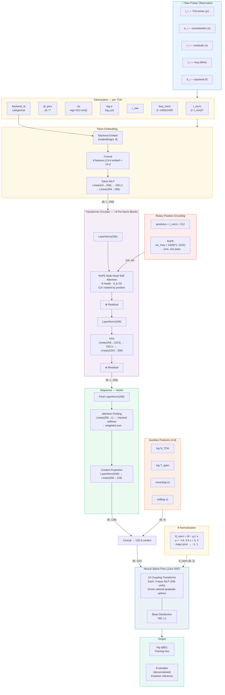

# PTA Transformer SBI

Toy proof-of-principle: **transformer-based neural posterior estimation for pulsar timing data**.

## What is this?

This project answers the question:

> *Does a transformer encoder over irregular, gappy TOA-level pulsar timing data provide a useful embedding for subsequent neural posterior estimation (NPE), compared to a simpler LSTM baseline?*

We implement a complete toy pipeline for a **single-pulsar red-noise inference** problem using simulation-based inference (SBI). Two encoder architectures (Transformer, LSTM) are paired with the **same** conditional normalizing flow posterior head, trained on simulated data, and compared against an exact analytic posterior.

## Scientific toy problem

**Infer a 2-D parameter vector** for one pulsar:

```
θ = (log10_A_red, gamma_red)
```

- `log10_A_red`: log₁₀ of the dimensionless strain amplitude (enterprise convention, prior [−17, −11])
- `gamma_red`: spectral slope of the red-noise power law (prior [0.5, 6.5])

The simulator generates irregular, variable-length, gappy observation schedules and produces TOA-level residuals. The model input is **TOA-level tokens** (not a fixed-length handcrafted spectrum), and evaluation includes comparison against an **exact Gaussian posterior** computed on a 2-D grid.

### What is simplified vs. a real PTA analysis

| Aspect | This toy | Real PTA |
|--------|----------|----------|
| Number of pulsars | 1 | 20–100 |
| Parameters | 2 (red noise) | Hundreds (DM, timing model, GWB, ...) |
| Timing model | None (residuals given) | Full multi-parameter fit |
| Units | Physical (seconds, yr⁻¹, strain) | Physical (seconds, Hz, strain) |
| White noise | Diagonal, known σ | EFAC/EQUAD/ECORR |
| Likelihood | Exact Gaussian | Same form but much larger |
| Schedule | Synthetic seasonal | Real observatory logs |

### Units and scaling

All quantities use the **standard PTA / enterprise convention**:
- Times are in years
- TOA uncertainties σ are in seconds, log-uniform in [10⁻⁷, 10⁻⁵] (100 ns – 10 μs)
- Red-noise amplitude A_red = 10^(log10_A_red), with log10_A_red ∈ [−17, −11]
- Spectral index gamma_red ∈ [0.5, 6.5]
- Reference frequency f_ref = 1.0 yr⁻¹
- Per-mode variance: ρ_k = (A² / 12π²) · yr² · (f_k/f_ref)^(−γ) · Δf   (in s²)
- Covariance: C = diag(σ²) + F·Φ(θ)·Fᵀ + jitter·I  with jitter = 10⁻²⁰

## Installation

```bash
conda create -n pta-sbi python=3.11 -y
conda activate pta-sbi
pip install numpy scipy matplotlib pyyaml tqdm torch zuko pytest
```

## Quick start — smoke run (CPU, ~30 seconds)

```bash
# Train transformer
python -m src.train --config configs/smoke_v3.yaml --model transformer --device cpu

# Train LSTM
python -m src.train --config configs/smoke_v3.yaml --model lstm --device cpu

# Evaluate both (comparison plots, metrics, robustness)
python -m src.evaluate --config configs/smoke_v3.yaml \
    --checkpoint outputs/smoke_v3/transformer/best_model.pt \
    --baseline-checkpoint outputs/smoke_v3/lstm/best_model.pt \
    --device cpu

# Demo: single-example posterior comparison
python -m src.demo_inference \
    --checkpoint outputs/smoke_v3/transformer/best_model.pt \
    --output outputs/smoke_v3/demo_inference.png \
    --device cpu
```

> Legacy configs (`smoke.yaml`, `transformer.yaml`, `lstm.yaml`) still exist for reproducibility but use the older arbitrary-units parameterisation. The `*_v3.yaml` configs use physical PTA/enterprise units and the improved architecture (RoPE, attention pooling, aux features, deeper flow).

## Full run (GPU recommended)

```bash
# Train transformer (v3 config — RoPE, attention pooling, aux features)
python -m src.train --config configs/transformer_v3.yaml --model transformer

# Train LSTM (v3 config — same data/flow/training, LSTM encoder)
python -m src.train --config configs/lstm_v3.yaml --model lstm

# Evaluate (comparison plots, metrics, robustness)
python -m src.evaluate --config configs/transformer_v3.yaml \
    --checkpoint outputs/v3/transformer/best_model.pt \
    --baseline-checkpoint outputs/v3/lstm/best_model.pt
```

## Running tests

```bash
python -m pytest tests/ -v
```

## Project structure

```
├── configs/
│   ├── smoke_v3.yaml       # Fast CPU smoke test (physical units, v3 arch)
│   ├── transformer_v3.yaml # Full transformer config (v3)
│   ├── lstm_v3.yaml        # Full LSTM config (v3)
│   ├── smoke.yaml          # Legacy smoke test (arbitrary units)
│   ├── transformer.yaml    # Legacy transformer config
│   └── lstm.yaml           # Legacy LSTM config
├── src/
│   ├── priors.py           # Uniform prior over θ
│   ├── schedules.py        # Synthetic observing schedule generator
│   ├── simulator.py        # Fourier-basis red-noise simulator
│   ├── exact_posterior.py  # Exact Gaussian posterior on 2-D grid
│   ├── masking.py          # Structured masking augmentations
│   ├── dataset.py          # PyTorch datasets (on-the-fly + fixed)
│   ├── collate.py          # Padding collate function
│   ├── metrics.py          # Hellinger, calibration, point-error
│   ├── plots.py            # All plotting helpers
│   ├── utils.py            # Config loading, seeding, device
│   ├── train.py            # Training script (CLI)
│   ├── evaluate.py         # Evaluation script (CLI)
│   ├── demo_inference.py   # Single-example demo (CLI)
│   └── models/
│       ├── tokenization.py        # TOA → token features
│       ├── transformer_encoder.py # Transformer + CLS + time embed
│       ├── lstm_encoder.py        # LSTM baseline encoder
│       ├── posterior_flow.py      # Zuko NSF conditional flow
│       └── model_wrappers.py      # NPEModel = encoder + flow
├── tests/
│   ├── test_simulator.py
│   ├── test_exact_posterior.py
│   ├── test_models.py
│   └── test_smoke_train_step.py
├── outputs/                # Generated checkpoints, plots, metrics
├── tutorial_sbi_framework.ipynb  # Interactive overview tutorial
├── tutorials/                    # In-depth tutorial series (5 notebooks)
│   ├── README.md
│   ├── 01_synthetic_data.ipynb
│   ├── 02_data_pipeline.ipynb
│   ├── 03_model_architecture.ipynb
│   ├── 04_training.ipynb
│   └── 05_evaluation.ipynb
└── requirements.txt
```

## Output plots

| Plot | Description |
|------|-------------|
| `training_curves.png` | Train/val neg-log-prob loss per epoch |
| `posterior_*.png` | Side-by-side exact vs learned 2-D posterior contours |
| `pp_*.png` | P-P calibration plot with KS statistics |
| `robustness.png` | Hellinger / KS / point-error vs masking severity for both models |
| `demo_inference.png` | Single-example: exact posterior, learned posterior, TOA time series |

## Interpretation guide

**In-distribution (no masking):** Both models should learn posteriors that roughly match the exact posterior. With only a smoke run (3 epochs, 2k samples), the posteriors will be diffuse but show the right structure.

**Under structured masking / truncation:** If the transformer matches the LSTM in-distribution but is clearly better under structured masking / truncation, that is evidence the attention-based approach is worth exploring further for real PTA data with irregular, gappy schedules.

**With the smoke run (3 epochs):** Both models are severely undertrained so the comparison is not conclusive. A full run with ~20k samples and 40 epochs should show clearer differentiation.

## Architecture



## Key design choices

- **TOA-level tokens**: Each observation is a token with 6 continuous features (normalized time, gap, residual/σ, log σ, raw residual, frequency) plus an embedded backend ID. No fixed-length spectrum.
- **Rotary Position Embeddings (RoPE)**: Injects timing information directly into the attention mechanism via rotation of query/key pairs — critical for irregularly-sampled data. (Legacy path uses additive TimeEmbedding + CLS token.)
- **Attention pooling**: A learnable attention-weighted mean replaces the CLS token for aggregating the sequence into a fixed-size context vector. (Legacy path uses CLS token output.)
- **Pre-norm transformer blocks**: LayerNorm before (not after) attention and FFN, improving training stability with deeper models.
- **Auxiliary features**: 4 summary statistics (log N_TOA, log T_span, mean/std of log σ) are concatenated to the context vector before the flow.
- **Shared posterior head**: Both encoders feed into the same Zuko NSF conditional normalizing flow, ensuring a fair comparison.
- **Theta normalisation**: Prior bounds are used to map θ to approximately [−1, 1] before the flow, keeping values within the NSF spline domain.
- **Structured masking augmentations**: Season dropout, end truncation, cadence thinning — not just iid random dropout.

## Tutorials

`tutorial_sbi_framework.ipynb` provides an interactive overview of the entire pipeline — from simulating data and computing exact posteriors to loading a trained model and demonstrating amortized inference.

The `tutorials/` folder contains a five-part deep-dive series:

| # | Notebook | Topics |
|---|---------|--------|
| 1 | [Synthetic Data Generation](tutorials/01_synthetic_data.ipynb) | Schedules, priors, Fourier red noise, power-law spectrum, sensitivity |
| 2 | [Data Pipeline](tutorials/02_data_pipeline.ipynb) | Tokenization, signed-log transform, masking augmentations, datasets, collation |
| 3 | [Model Architecture](tutorials/03_model_architecture.ipynb) | Token embedding, RoPE, pre-norm blocks, attention pooling, NSF flow, LSTM comparison |
| 4 | [Training](tutorials/04_training.ipynb) | Config system, NPE loss, LR scheduling, AMP, early stopping |
| 5 | [Evaluation](tutorials/05_evaluation.ipynb) | Exact posteriors, Hellinger distance, P-P calibration, robustness |
